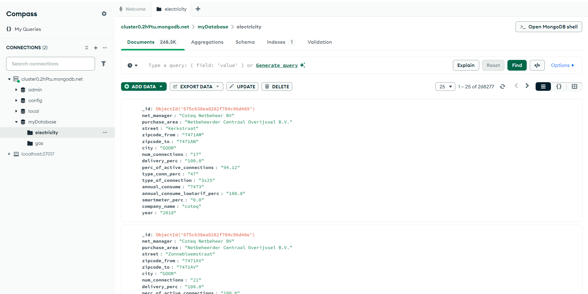
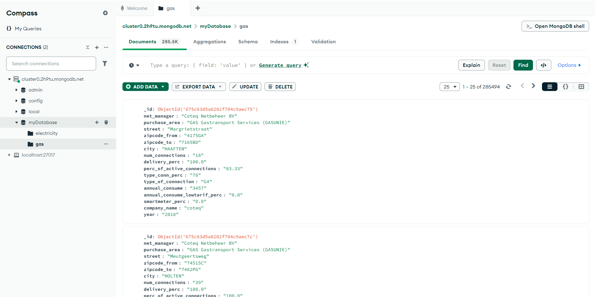
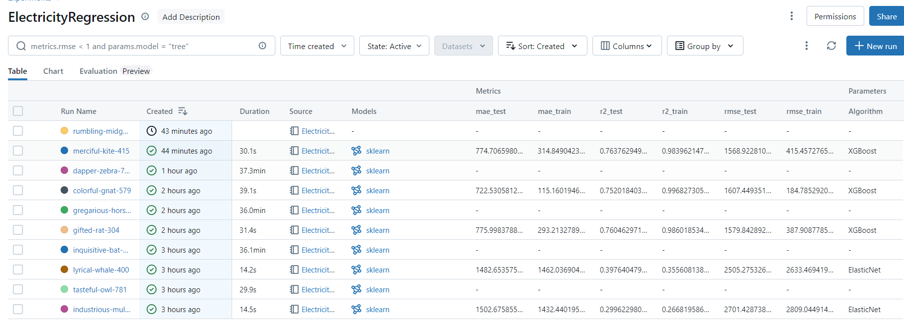
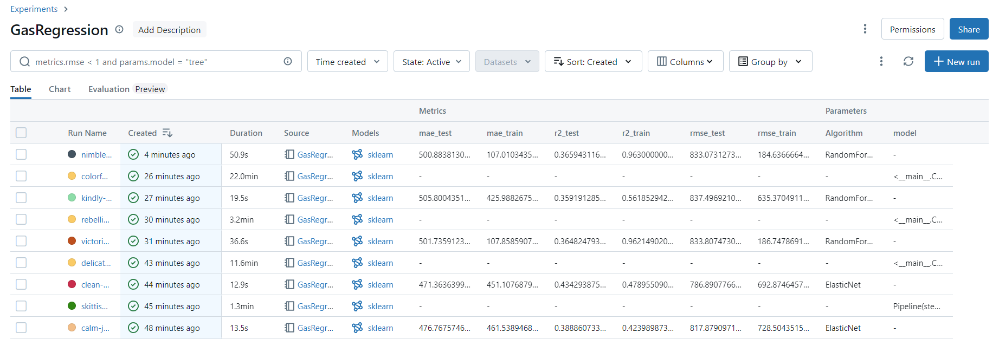
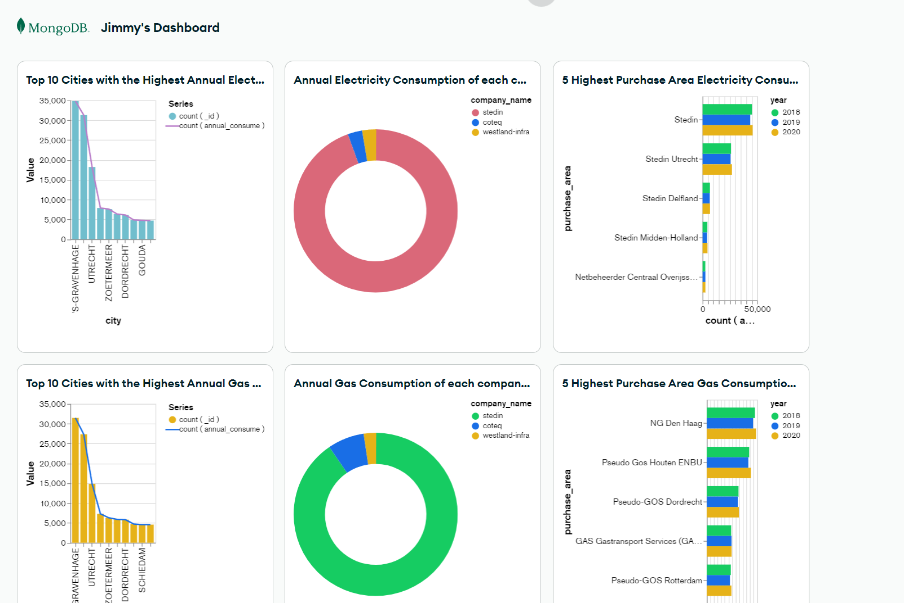

# **EEET2574 - Assignment 2: MongoDB and Spark**

### **Student Information**  
**Name**: Truong Vo Thien Nhan  
**ID**: s3929215  

---

## **Overview**

This project demonstrates the use of **MongoDB** and **Spark** for data processing and regression model training. The submission includes two main notebooks within the provided `s3929215.dbc` file:  

- 📓 **ElectricityRegression**: Handles data processing and model training for electricity-related data.  
- 📓 **GasRegression**: Handles data processing and model training for gas-related data.  

> **⚠️ Assignment Questions:** All questions are answered in the `ElectricityRegression` notebook.

## **Note** : 
Databrick Community takes long times for training model process and sometimes miss the output of executed cells.
For quick look, please using the jupeter notebook on your local instead.

---

## **Task 1: MongoDB Integration**

### **Uploading Data to MongoDB**  

To upload data to your MongoDB cluster:  

1. Open the script `data_upload.py`.  
2. Replace the placeholder with your MongoDB Cluster path.  
3. Run one of the following commands in your terminal:  

   ```bash
   python ./data_upload.py
   ```

   ```bash
   python3 ./data_upload.py
   ```

---

### **MongoDB Collection Screenshots**

#### **Electricity Collection**


#### **Gas Collection**


---

### **ML Flows**
**Image **  
Electricity: 


---

### **Visualization**

Below is a visualization of the data processed during the assignment:  

  

🔗 **[View Interactive Dashboard](https://charts.mongodb.com/charts-project-0-tgoyzmr/public/dashboards/6770cecd-5a5b-4b03-8f18-dd9fbd0c221e)**  

---

### **Files Included**  

- `data_upload.py`: Script for uploading data to MongoDB.  
- `s3929215.dbc`: Databricks file containing the following notebooks:  
  - **ElectricityRegression**  
  - **GasRegression**  

---

### **How to Run the Project**  

1. Ensure you have Python installed.  
2. Replace the MongoDB cluster path in the `data_upload.py` script.  
3. Use the provided commands to upload data to MongoDB.  
4. Import `s3929215.dbc` into Databricks to explore the notebooks.  
